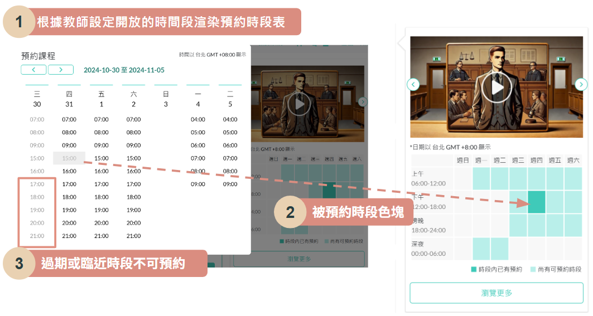

# Talking Topia — 線上家教平台

**Build School 專題作品**

[](https://docs.google.com/presentation/d/1XYwkSV8wAzxgSSdiYePEwL_ryG7Bd-YxK6nZWQ-yzPA/edit?slide=id.g3014e9f0da1_3_75#slide=id.g3014e9f0da1_3_75)
[](https://github.com/hsinhan-h/talking-topia-admin)

---

## 專案簡介

擔任**組長**，與組員合力開發線上家教平台，具備完整的教師註冊、課程上架、課程購買、時段預約與後台管理等功能。

使用 **Git / GitHub** 進行版本控制，搭配 **Azure DevOps** 管理專案、**CI/CD 自動化部署**，並整合 **SonarCloud** 進行程式碼品質掃描。

---

## Web 前台技術說明

以 **ASP.NET Core** 為框架，使用 **Razor** 與 **Vue.js** 進行前端畫面渲染，搭配 **Axios** 處理前後端資料傳遞。
後端實踐 **DI 相依性注入**，Repository 透過泛型方法提升使用彈性。

---

## 個人負責模組

| 層級 | 模組 |
| ---- | ---- |
| **前台** | 課程列表、課程篩選器、課程預約模組、Coravel 排程通知、Redis 分散式快取 |
| **後台** | 課程審核、課程管理（上下架 / 編輯）、Cloudinary 串接 |
| **其他** | 資料庫 Schema 設計、組員技術支援 |

---

## 個人負責模組技術細節

### 1. 課程列表頁面


#### 查詢效率優化

- 採用**分頁技術**，僅合併當前頁面所需資料，避免全表查詢，顯著提升跨多張資料表的複雜查詢效能

#### 讀取效率優化

- 使用 **Redis 分散式快取**將重複的查詢與篩選結果存入快取
- 搭配 **Lazysizes** 進行圖片與影片的延遲載入（Lazy Loading），使頁面加載速度提升三倍
- 將 Redis 操作抽取為 **Cache Helper 類別**，供多個模組共用，提升程式碼可重用性

---

### 2. 課程篩選器


#### 多條件篩選與排序

- 使用 **Query String** 接收多個篩選及排序條件，確保用戶刷新頁面時保有篩選狀態，提升使用者體驗
- 篩選選單的資料來自動態資料，初次載入後存入快取

#### 複合篩選功能

- 支援同一篩選器同時篩選**星期與時間段**，亦可單獨篩選星期或時間

#### 篩選效能優化

- 使用 **Lodash `debounce`** 技術，將快速連點行為合併為單一 API 請求，避免過度頻繁的請求觸發

---

### 3. 課程預約模組




#### 即時渲染與元件共用

- 動態渲染預約表格，將表格部分抽離為獨立元件，並將 JavaScript 封裝為模組，實現跨頁面共用，維持程式碼可維護性

#### 排程掃描功能

- **後端**：結合 **Coravel 排程**與 **MailKit**，於課程預約成功後自動發送確認信，並在課程開始前數天自動發送提醒信
- **前端**：用戶點擊預約時段時，以 **LocalStorage** 記錄時間戳，並透過 **setInterval** 定期掃描；若超過選定時間加 6 小時（設置 6 小時內不可重複預約），頁面自動刷新

---

## 專案架構

### Clean Architecture 四層結構

```text
TalkingTopia_MVC/
├── ApplicationCore/          # 領域層 (Domain Layer) — 不依賴其他專案
│   ├── Entities/             # 領域實體 (Member, Course, Booking, Order …)
│   ├── Interfaces/           # 服務與 Repository 合約 (IRepository<T> …)
│   ├── Services/             # 核心業務邏輯實作
│   ├── Dtos/                 # 資料傳輸物件
│   ├── Enums/                # 領域列舉
│   ├── Helpers/              # 工具類別
│   └── Settings/             # 設定類別 (MongoDB 等)
│
├── Infrastructure/           # 基礎設施層 — 外部服務與資料存取
│   ├── Data/
│   │   ├── TalkingTopiaDbContext.cs   # EF Core DbContext (SQL Server)
│   │   ├── EfRepository.cs            # 泛型 Repository 實作
│   │   └── EfTransaction.cs           # 交易處理
│   ├── Service/
│   │   ├── CloudinaryService          # 圖片 CDN
│   │   ├── EmailService               # 郵件發送 (MailKit)
│   │   ├── LineAuthService            # Line OAuth 2.0
│   │   ├── CacheService               # Redis 快取
│   │   └── ECpayService               # 金流串接
│   ├── Migrations/                    # EF Core Migrations
│   └── Dependencies.cs                # DI 註冊
│
├── Web/                      # MVC 前台應用程式
│   ├── Controllers/
│   │   ├── (Page Controllers)         # AccountController, HomeController …
│   │   └── Api/                       # AJAX 端點 (CourseListApi, BookingTableApi …)
│   ├── Views/                         # Razor 視圖
│   ├── Services/                      # Web 層服務 (BookingService, CourseService …)
│   ├── Hubs/ChatHub.cs                # SignalR 即時聊天 (訊息存至 MongoDB)
│   ├── ViewModels/                    # 呈現層模型
│   ├── Configurations/
│   │   ├── ConfigureApplicationCoreService.cs
│   │   └── ConfigureWebService.cs
│   └── Program.cs                     # 啟動設定 (Cookie Auth, SignalR, Redis, Coravel, MongoDB)
│
└── Api/                      # REST API (後台 / 程式化存取)
    ├── Controllers/           # AuthController, CourseManagementApi, BookingController …
    ├── Services/              # API 專屬服務層
    ├── Configurations/        # DI 註冊
    ├── Settings/JwtSettings.cs
    └── Program.cs             # 啟動設定 (JWT Auth, Swagger, CORS)
```

### 架構分層圖

```text
┌─────────────────────────────────────────────────────────────┐
│                        用戶 / 瀏覽器                          │
└──────────────────┬──────────────────────┬───────────────────┘
                   │ HTTP/WebSocket        │ REST API (JWT)
         ┌─────────▼─────────┐   ┌────────▼────────┐
         │     Web (MVC)      │   │    Api (REST)    │
         │  Razor + Vue.js   │   │    Swagger UI    │
         │  Cookie Auth      │   │    JWT Bearer    │
         │  SignalR ChatHub  │   │    Dapper ORM    │
         └─────────┬─────────┘   └────────┬────────┘
                   │                       │
         ┌─────────▼───────────────────────▼─────────┐
         │              ApplicationCore                │
         │   Entities │ Interfaces │ Services │ DTOs   │
         └─────────────────────┬─────────────────────┘
                               │
         ┌─────────────────────▼─────────────────────┐
         │               Infrastructure               │
         │  EF Core Repository │ External Services   │
         └──┬──────┬──────┬──────┬──────┬────────┬──┘
            │      │      │      │      │        │
         SQL    MongoDB  Redis  Line  ECpay  Cloudinary
        Server  (Chat)  (Cache) OAuth  (Pay)   (CDN)
```

### 外部服務整合

| 服務 | 用途 | 設定鍵 |
| ---- | ---- | ------ |
| **SQL Server** (Azure) | 主要關聯式資料庫 | `ConnectionStrings:TalkingTopiaDb` |
| **MongoDB** | 聊天訊息 + 向量搜尋 | `MongoDbSettings` |
| **Redis** | 分散式 Session / 快取 | `ConnectionStrings:Redis` |
| **OpenAI / Azure OpenAI** | Semantic Kernel AI 功能 | `OpenAIApiKey` |
| **Dify Workflow** | 課程推薦 AI | `DifyWorkFlowApiEndpoint` |
| **SignalR** | 即時聊天 (`/chatHub`) | — |
| **Cloudinary** | 圖片 CDN | `Cloudinary` |
| **ECpay** | 金流處理 | `ECpaySettings` |
| **Line OAuth** | 第三方登入 | Line SDK 設定 |
| **Coravel** | 排程任務（預約提醒） | — |

---

## 技術棧

| 類別 | 技術 |
| ---- | ---- |
| **框架** | ASP.NET Core 8.0、Entity Framework Core 8.0 |
| **前端** | Razor Pages、Vue.js、Axios、Lodash、Lazysizes |
| **資料庫** | SQL Server、MongoDB、Redis |
| **認證** | Cookie Auth、JWT Bearer、Line OAuth 2.0 |
| **AI** | Microsoft Semantic Kernel 1.25、OpenAI SDK、Dify Workflow |
| **即時通訊** | SignalR |
| **排程** | Coravel |
| **金流** | ECpay |
| **圖片** | Cloudinary |
| **郵件** | NETCore.MailKit |
| **CI/CD** | Azure DevOps Pipelines、SonarCloud |
| **版控** | Git / GitHub |

---

## 本地執行

```bash
# 建置
dotnet build TalkingTopia.sln

# Web 前台 (https://localhost:7263)
dotnet run --project Web/Web.csproj

# REST API (Swagger: /swagger/index.html)
dotnet run --project Api/Api.csproj

# 資料庫 Migration
dotnet ef migrations add <MigrationName> --project Infrastructure --startup-project Web
dotnet ef database update --project Infrastructure --startup-project Web
```

> 敏感設定（連線字串、API Key、JWT 簽署金鑰）請使用 .NET User Secrets，勿直接寫入 `appsettings.json`。
